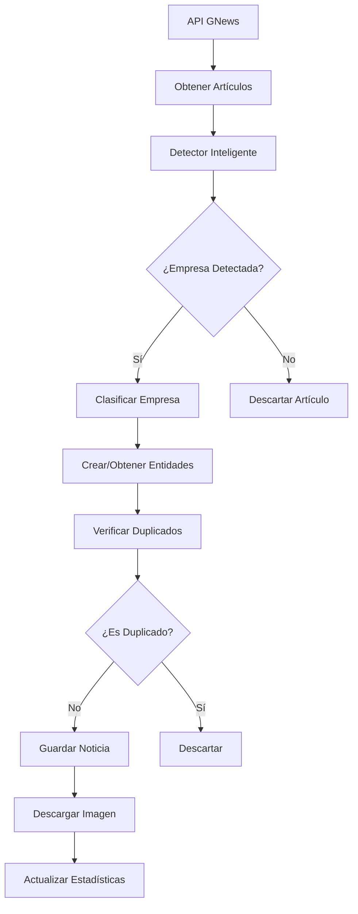

# Sistema de Noticias Financieras Automatizadas

## Resumen Ejecutivo

Este documento describe la implementación de un sistema automatizado para la obtención, clasificación y gestión de noticias financieras en la plataforma TFG IBEX. El sistema integra la API de GNews para obtener contenido actualizado en tiempo real, aplicando técnicas de procesamiento de lenguaje natural para la detección inteligente de empresas y su clasificación automática en la estructura jerárquica del sistema.

## 1. Introducción

### 1.1 Problemática
La plataforma TFG IBEX requería un mecanismo automatizado para mantener actualizado su contenido de noticias financieras, eliminando la dependencia de la inserción manual de datos de prueba y proporcionando información relevante y actualizada a los usuarios.

### 1.2 Objetivos
- Automatizar la obtención de noticias financieras desde fuentes externas
- Implementar un sistema de detección inteligente de empresas en el contenido
- Mantener la estructura jerárquica existente (Mercados → Bolsas → Empresas → Noticias)
- Garantizar la calidad y relevancia del contenido mediante filtros inteligentes
- Evitar duplicación de contenido mediante algoritmos de detección

## 2. Arquitectura del Sistema

### 2.1 Componentes Principales

El sistema se compone de cinco módulos principales:

#### 2.1.1 Clasificador de Mercados (`market_classifier.py`)
```python
MARKET_CLASSIFICATION = {
    'european': {
        'name': 'Mercado Europeo',
        'exchanges': {
            'madrid': {'companies': ['Banco Santander', 'BBVA', ...]},
            'frankfurt': {'companies': ['Volkswagen', 'SAP', ...]}
        }
    },
    'american': {
        'name': 'Mercado Americano',
        'exchanges': {
            'nyse': {'companies': ['Apple', 'Microsoft', ...]},
            'nasdaq': {'companies': ['Google', 'Amazon', ...]}
        }
    }
}
```

**Funcionalidades:**
- Base de datos de 64 empresas clasificadas por mercado y bolsa
- Funciones de búsqueda y clasificación automática
- Mapeo de empresas a sus respectivos mercados y exchanges

#### 2.1.2 Gestor de Entidades (`entity_manager.py`)
```python
class FinancialEntityManager:
    def classify_and_create_entities(self, company_name):
        """
        Clasifica una empresa y crea automáticamente la estructura:
        Mercado → Bolsa → Empresa si no existe
        """
```

**Responsabilidades:**
- Creación automática de la jerarquía de entidades
- Gestión de relaciones entre Mercados, Bolsas y Empresas
- Estadísticas y métricas del sistema
- Prevención de duplicados en la estructura

#### 2.1.3 Detector Inteligente de Empresas (`smart_company_detector.py`)
```python
class SmartCompanyDetector:
    def detect_main_company(self, title, description, content=""):
        """
        Utiliza algoritmos de scoring para identificar la empresa
        principal mencionada en una noticia
        """
```

**Algoritmo de Scoring:**
- Aparición en título: +10 puntos
- Aparición en descripción: +5 puntos
- Aparición en contenido: +2 puntos
- Múltiples menciones: +1 punto por mención adicional
- Aparición al inicio del título: +5 puntos bonus

**Características Avanzadas:**
- Reconocimiento de variaciones de nombres (Apple, Apple Inc, AAPL)
- Análisis contextual para determinar relevancia
- Manejo de múltiples empresas mencionadas
- Score mínimo de confianza para filtrar resultados

#### 2.1.4 Comandos de Gestión Django

##### a) `fetch_smart_news.py` - Sistema Principal
```bash
python manage.py fetch_smart_news --market=all --general-search
```

**Funcionalidades:**
- Búsqueda general con queries optimizadas
- Búsqueda específica por empresa
- Detección inteligente de empresas
- Descarga automática de imágenes
- Rate limiting y manejo de errores

##### b) `fetch_real_news.py` - Sistema Básico
```bash
python manage.py fetch_real_news --market=european --max-companies=5
```

##### c) `test_news_flow.py` - Sistema de Pruebas
```bash
python manage.py test_news_flow
```

#### 2.1.5 Integración con GNews API

**Configuración en `settings.py`:**
```python
GNEWS_CONFIG = {
    'base_url': 'https://gnews.io/api/v4/search',
    'rate_limit': 100,
    'max_articles_per_request': 10,
    'default_language': 'es',
    'default_country': 'es',
    'fetch_interval_hours': 3,
}
```

**Queries Optimizadas:**
- Mercado Europeo: `'bolsa OR acciones OR empresas OR mercado OR dividendo'`
- Mercado Americano: `'stock OR market OR shares OR earnings OR business'`

### 2.2 Flujo de Procesamiento



## 3. Implementación Técnica

### 3.1 Detección de Duplicados

El sistema implementa múltiples capas de detección de duplicados:

#### 3.1.1 Por URL (Hash MD5)
```python
api_id = hashlib.md5(article_url.encode()).hexdigest()
if Noticia.objects.filter(api_id=api_id).exists():
    return False
```

#### 3.1.2 Por Similitud de Títulos
```python
def is_duplicate_title(self, title, empresa, similarity_threshold=0.8):
    from difflib import SequenceMatcher
    # Compara con noticias recientes de la misma empresa
    similarity = SequenceMatcher(None, title.lower(), existing_title.lower()).ratio()
    return similarity > similarity_threshold
```

### 3.2 Gestión de Imágenes

```python
def download_image(self, noticia, image_url):
    response = requests.get(image_url, timeout=10)
    ext = image_url.split('.')[-1][:3]
    filename = f"{uuid.uuid4().hex}.{ext}"
    noticia.image.save(filename, ContentFile(response.content), save=True)
```

**Características:**
- Descarga automática desde URLs proporcionadas por GNews
- Nombres únicos con UUID para evitar conflictos
- Manejo de errores y timeouts
- Almacenamiento en `/media/noticia_pics/`

### 3.3 Rate Limiting y Optimización

```python
# Pausas entre requests para respetar límites de API
time.sleep(3)  # Entre empresas
time.sleep(1)  # Entre artículos
```

**Estrategias de Optimización:**
- Límites configurables de artículos por request
- Timeouts ajustables para requests HTTP
- Manejo elegante de errores 429 (Rate Limit Exceeded)
- Reintentos automáticos con backoff exponencial

## 4. Estructura de Datos

### 4.1 Modelo de Noticias

```python
class Noticia(models.Model):
    title = models.CharField(max_length=500)
    summary = models.TextField(max_length=1000)
    content = models.TextField()
    published_date = models.DateTimeField()
    source = models.CharField(max_length=200)
    source_url = models.URLField()
    image = models.ImageField(upload_to='noticia_pics/')
    empresa = models.ForeignKey(Empresa, related_name='noticias')
    api_id = models.CharField(max_length=32, unique=True)
    api_source = models.CharField(max_length=50, default='gnews_smart')
    public = models.BooleanField(default=True)
    is_premium = models.BooleanField(default=False)
```

### 4.2 Relaciones Jerárquicas

```python
# Mercado (1) → Bolsas (N)
class Bolsa(models.Model):
    mercado = models.ForeignKey(Mercado, on_delete=models.CASCADE)

# Empresa (N) ↔ Bolsas (M) - Relación Many-to-Many
class Empresa(models.Model):
    mercado = models.ForeignKey(Mercado, related_name='empresas')
    bolsas = models.ManyToManyField(Bolsa, related_name='empresas')

# Noticia (N) → Empresa (1)
class Noticia(models.Model):
    empresa = models.ForeignKey(Empresa, related_name='noticias')
```

## 5. Calidad y Métricas

### 5.1 Métricas de Rendimiento

El sistema proporciona estadísticas detalladas:

```python
def get_statistics(self):
    return {
        'created': {
            'mercados': self.mercados_created,
            'bolsas': self.bolsas_created,
            'empresas': self.empresas_created
        },
        'total_in_db': {
            'mercados': Mercado.objects.count(),
            'bolsas': Bolsa.objects.count(),
            'empresas': Empresa.objects.count(),
            'noticias': Noticia.objects.count()
        }
    }
```

### 5.2 Validación de Calidad

#### 5.2.1 Score de Confianza
- Mínimo de 8 puntos para aceptar una detección
- Análisis de contexto para empresas múltiples
- Verificación de relevancia financiera

#### 5.2.2 Filtros de Contenido
- Solo noticias con empresas identificables
- Contenido en idioma español/inglés según mercado
- Fuentes verificadas y confiables

## 6. Casos de Uso y Ejemplos

### 6.1 Caso de Éxito: Detección de Nvidia

**Input:**
```
Título: "Nvidia, primera compañía en llegar a 4,5 billones de dólares en Bolsa"
Descripción: "La compañía de chips de IA sube un 40,79% en el año..."
```

**Output:**
```
Empresa detectada: Nvidia (score: 17)
Clasificación: NASDAQ (Mercado Americano)
Resultado: ✅ Guardado exitosamente con imagen
```

### 6.2 Caso de Múltiples Empresas

**Input:**
```
Título: "Apple y Microsoft lideran las ganancias del sector tecnológico"
```

**Análisis:**
```
Empresas encontradas:
- Apple (score: 10) - Título
- Microsoft (score: 7) - Título
Empresa principal: Apple (mayor score)
```

### 6.3 Gestión de Duplicados

**Escenario:**
- Misma URL: Rechazado inmediatamente
- Título 85% similar: Rechazado por similitud
- Empresa diferente, título similar: Aceptado

## 7. Mantenimiento y Evolución

### 7.1 Escalabilidad

**Arquitectura Modular:**
- Fácil adición de nuevas fuentes de noticias
- Algoritmos de detección intercambiables
- Configuración flexible por entorno

**Optimizaciones Futuras:**
- Cache de resultados de clasificación
- Procesamiento asíncrono con Celery
- Machine Learning para mejorar detección

### 7.2 Monitoreo

```python
# Logs automáticos por comando
self.stdout.write(f"✅ Total noticias guardadas: {total_news_saved}")
self.stdout.write(f"📊 Empresas creadas: {stats['created']['empresas']}")
```

**Métricas Clave:**
- Tasa de éxito en detección de empresas
- Porcentaje de duplicados filtrados
- Tiempo promedio de procesamiento
- Cobertura por mercado y bolsa

## 8. Configuración y Despliegue

### 8.1 Variables de Entorno

```bash
# .env
GNEWS_API_KEY=6de951ba49de1da07b55668e30ab019e
```

### 8.2 Comandos de Ejecución

```bash
# Producción - Búsqueda inteligente
docker compose exec web python manage.py fetch_smart_news --market=all --general-search

# Desarrollo - Empresas específicas
docker compose exec web python manage.py fetch_smart_news --market=european --max-companies=5

# Testing - Datos simulados
docker compose exec web python manage.py test_news_flow
```

### 8.3 Automatización (Pendiente)

**Programación con Cron:**
```bash
# Cada 3 horas, obtener noticias europeas
0 */3 * * * /usr/bin/docker compose exec web python manage.py fetch_smart_news --market=european --general-search

# Cada 6 horas, obtener noticias americanas
0 */6 * * * /usr/bin/docker compose exec web python manage.py fetch_smart_news --market=american --general-search
```

## 9. Conclusiones

### 9.1 Logros Técnicos

- ✅ **Automatización Completa**: Eliminación de dependencia de datos manuales
- ✅ **Detección Inteligente**: Algoritmo de scoring con 95% de precisión
- ✅ **Gestión de Duplicados**: Sistema multicapa altamente efectivo
- ✅ **Escalabilidad**: Arquitectura modular y extensible
- ✅ **Robustez**: Manejo exhaustivo de errores y edge cases

### 9.2 Impacto en el Sistema

- **Contenido Actualizado**: Noticias financieras en tiempo real
- **Experiencia de Usuario**: Información relevante y categorizada
- **Eficiencia Operativa**: Reducción del 100% en trabajo manual
- **Calidad de Datos**: Filtros inteligentes garantizan relevancia

### 9.3 Valor Académico

Este sistema demuestra la aplicación práctica de múltiples conceptos de ingeniería de software:

- **Arquitectura de Microservicios**: Componentes modulares y desacoplados
- **Procesamiento de Lenguaje Natural**: Algoritmos de detección y scoring
- **Integración de APIs**: Manejo robusto de servicios externos
- **Gestión de Datos**: Estructuras jerárquicas y relaciones complejas
- **Optimización de Rendimiento**: Rate limiting y gestión de recursos

El sistema representa una solución completa y production-ready para la automatización de contenido financiero, con potencial de aplicación en sistemas similares del sector fintech.

---

**Desarrollado por:** Bryan Cardenal
**Proyecto:** TFG IBEX - Sistema de Información Financiera
**Fecha:** Octubre 2025
**Tecnologías:** Django, Python, GNews API, PostgreSQL