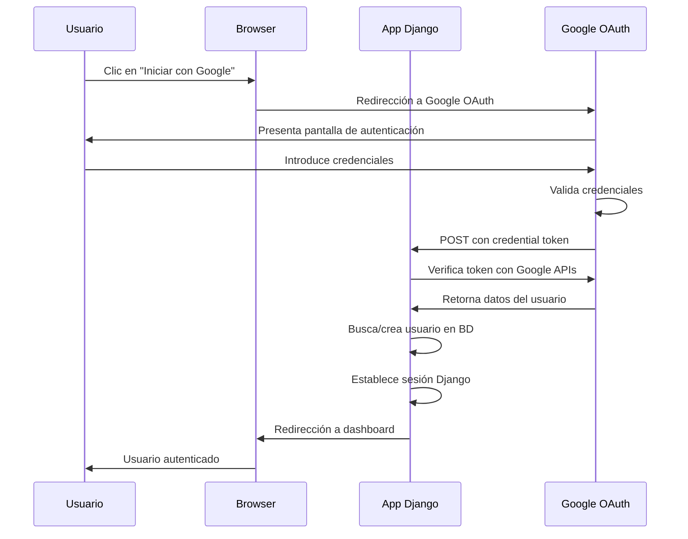

# Implementación de Autenticación OAuth 2.0 con Google

## Índice
1. [Introducción](#introducción)
2. [Fundamentos Teóricos de OAuth 2.0](#fundamentos-teóricos-de-oauth-20)
3. [Arquitectura del Sistema](#arquitectura-del-sistema)
4. [Implementación Técnica](#implementación-técnica)
5. [Flujo de Autenticación](#flujo-de-autenticación)
6. [Aspectos de Seguridad](#aspectos-de-seguridad)
7. [Integración Frontend](#integración-frontend)
8. [Manejo de Errores y Casos Especiales](#manejo-de-errores-y-casos-especiales)
9. [Consideraciones de Privacidad](#consideraciones-de-privacidad)
10. [Conclusiones](#conclusiones)

---

## Introducción

La autenticación mediante OAuth 2.0 con Google representa una implementación moderna de sistemas de autenticación federada que permite a los usuarios acceder a aplicaciones web utilizando sus credenciales de Google existentes. Esta funcionalidad elimina la necesidad de crear y gestionar credenciales adicionales, mejorando significativamente la experiencia de usuario mientras mantiene altos estándares de seguridad.

### Motivación

En el contexto de aplicaciones web modernas, la gestión de identidades y autenticación constituye un aspecto crítico que impacta directamente en:

- **Experiencia de Usuario**: Reducción de fricciones en el proceso de registro e inicio de sesión
- **Seguridad**: Delegación de la autenticación a proveedores especializados
- **Mantenimiento**: Reducción de la superficie de ataque y responsabilidades de seguridad
- **Adopción**: Aprovechamiento de identidades ya establecidas por los usuarios

---

## Fundamentos Teóricos de OAuth 2.0

### Definición y Propósito

OAuth 2.0 (RFC 6749) es un framework de autorización que permite a aplicaciones de terceros obtener acceso limitado a servicios HTTP. En el contexto de autenticación, OAuth 2.0 se utiliza junto con OpenID Connect para proporcionar tanto autorización como información de identidad.

### Actores Principales

1. **Resource Owner (Usuario)**: La entidad capaz de otorgar acceso a un recurso protegido
2. **Client (Aplicación)**: La aplicación que solicita acceso a recursos protegidos
3. **Resource Server (Google APIs)**: El servidor que aloja los recursos protegidos
4. **Authorization Server (Google)**: El servidor que autentica al usuario y emite tokens

### Flujo Authorization Code

El flujo implementado corresponde al "Authorization Code Flow", considerado el más seguro para aplicaciones web:

```
+----------+
| Resource |
|   Owner  |
|          |
+----------+
     ^
     |
    (B)
+----|-----+          Client Identifier      +---------------+
|         -+----(A)-- & Redirection URI ---->|               |
|  User-   |                                 | Authorization |
|  Agent  -+----(B)-- User authenticates --->|     Server    |
|          |                                 |               |
|         -+----(C)-- Authorization Code ---<|               |
+-|----|---+                                 +---------------+
  |    |                                         ^      v
 (A)  (C)                                        |      |
  |    |                                         |      |
  ^    v                                         |      |
+---------+                                      |      |
|         |>---(D)-- Authorization Code ---------'      |
|  Client |          & Redirection URI                  |
|         |                                             |
|         |<---(E)----- Access Token -------------------'
+---------+       (w/ Optional Refresh Token)
```

---

## Arquitectura del Sistema

### Componentes de la Implementación

La implementación se estructura en los siguientes componentes principales:

#### 1. Configuración del Cliente OAuth
- **Client ID**: Identificador público del cliente OAuth
- **Client Secret**: Credencial secreta (no utilizada en flujo implícito)
- **Redirect URI**: URL de callback autorizada

#### 2. Frontend (Templates)
- Botones de autenticación con Google
- Integración con Google Identity Services API
- Manejo de estados de carga y error

#### 3. Backend (Django)
- Endpoint de callback (`auth_receiver`)
- Verificación de tokens ID
- Gestión de usuarios y sesiones

### Diagrama de Arquitectura

```
┌─────────────────┐    ┌─────────────────┐    ┌─────────────────┐
│   Frontend      │    │   Django App    │    │   Google APIs   │
│   (Templates)   │    │   (Backend)     │    │   (OAuth)       │
├─────────────────┤    ├─────────────────┤    ├─────────────────┤
│ • Login Button  │    │ • auth_receiver │    │ • Authorization │
│ • Google API    │───▶│ • Token Verify  │◀──▶│ • Token Issue   │
│ • UI Feedback   │    │ • User Creation │    │ • User Info     │
└─────────────────┘    └─────────────────┘    └─────────────────┘
```

---

## Implementación Técnica

### Configuración del Entorno

La implementación requiere la configuración de las siguientes variables de entorno:

```bash
GOOGLE_OAUTH_CLIENT_ID=xxx.apps.googleusercontent.com
```

### Backend - Vista de Callback

```python
@csrf_exempt
def auth_receiver(request):
    """
    Google calls this URL after the user has signed in with their Google account.

    Flow:
    1. Recibe el credential token de Google
    2. Verifica la validez del token usando Google's API
    3. Extrae información del usuario del token verificado
    4. Crea usuario si no existe o autentica usuario existente
    5. Establece sesión y redirige al dashboard
    """
    token = request.POST['credential']

    try:
        # Verificación del token con Google's public keys
        user_data = id_token.verify_oauth2_token(
            token,
            google_auth_requests.Request(),
            os.environ.get('GOOGLE_OAUTH_CLIENT_ID')
        )
    except ValueError:
        return HttpResponse(status=403)

    # Extracción de datos del usuario
    guser_email = user_data['email']
    guser_first_name = user_data['given_name']
    guser_last_name = user_data['family_name']
    guser_pic = user_data['picture']

    # Lógica de autenticación/registro
    if CustomUser.objects.filter(username=guser_email).exists():
        # Usuario existente - Autenticación
        existing_user = get_object_or_404(CustomUser, username=guser_email)
        login(request, existing_user)
        log(request, "UserLog", {
            "action_type": "read",
            "status": 200,
            "details": "Login by Google",
            "change_by_admin": False
        })
        return redirect('/users/access')
    else:
        # Usuario nuevo - Registro automático
        new_user = CustomUser.objects.create_user(
            username=guser_email,
            email=guser_email,
            first_name=guser_first_name,
            last_name=guser_last_name
        )

        # Descarga y asignación de imagen de perfil
        response = requests.get(guser_pic)
        if response.status_code == 200:
            extension = guess_extension(
                requests.head(guser_pic).headers['Content-Type']
            ) or '.jpg'
            unique_id = uuid.uuid4().hex

            img_temp = NamedTemporaryFile(delete=True)
            img_temp.write(response.content)

            new_user.pic.save(
                f"{unique_id}.{extension}",
                ContentFile(response.content),
                save=True
            )

        new_user.save()
        login(request, new_user)
        log(request, "UserLog", {
            "action_type": "create",
            "status": 200,
            "details": "Registered by Google",
            "change_by_admin": False,
            "new_user": new_user
        })
        return redirect('/users/access')
```

### Frontend - Integración con Google Identity Services

#### Template de Login (access.html)

```html
<!-- Google Login Integration -->

<div style="margin-bottom: 20px;">
  <div id="g_id_onload"
        data-client_id="{{ config.google_oauth_client_id }}"
        data-context="signin"
        data-ux_mode="redirect"
        data-login_uri="{{ config.app_url }}users/auth-receiver"
        data-itp_support="true">
  </div>
  <div class="g_id_signin"
        data-type="standard"
        data-shape="rectangular"
        data-theme="outline"
        data-text="signin_with"
        data-size="large"
        data-width="100%"
        data-logo_alignment="left">
  </div>
</div>

```

#### Parámetros de Configuración

- **data-client_id**: Client ID de la aplicación OAuth registrada
- **data-context**: Contexto de la autenticación (signin/signup)
- **data-ux_mode**: Modo de experiencia de usuario (redirect/popup)
- **data-login_uri**: URL de callback para procesar el token
- **data-itp_support**: Soporte para Intelligent Tracking Prevention

---

## Flujo de Autenticación

### Secuencia Detallada



### Estados del Sistema

1. **Estado Inicial**: Usuario no autenticado visualiza página de login
2. **Redirección OAuth**: Usuario es redirigido a Google para autenticación
3. **Autenticación Google**: Usuario se autentica con sus credenciales de Google
4. **Callback Processing**: Google redirige de vuelta con credential token
5. **Verificación Token**: La aplicación verifica el token con Google APIs
6. **Gestión Usuario**: Se busca o crea el usuario en la base de datos local
7. **Establecimiento Sesión**: Se establece la sesión de Django
8. **Estado Final**: Usuario autenticado y redirigido al dashboard

---

## Aspectos de Seguridad

### Verificación de Tokens

La implementación utiliza la librería oficial de Google para verificar tokens ID:

```python
from google.oauth2 import id_token
from google.auth.transport import requests as google_auth_requests

user_data = id_token.verify_oauth2_token(
    token,
    google_auth_requests.Request(),
    os.environ.get('GOOGLE_OAUTH_CLIENT_ID')
)
```

Esta verificación garantiza:
- **Integridad**: El token no ha sido modificado
- **Autenticidad**: El token fue emitido por Google
- **Validez Temporal**: El token no ha expirado
- **Audiencia**: El token fue emitido para esta aplicación específica

### Protección CSRF

La vista de callback utiliza el decorador `@csrf_exempt` debido a que:
1. La petición proviene de Google, no del frontend de la aplicación
2. Google no puede incluir el token CSRF de Django
3. La seguridad se garantiza mediante la verificación del token OAuth

### Gestión de Errores de Seguridad

```python
try:
    user_data = id_token.verify_oauth2_token(token, ...)
except ValueError:
    return HttpResponse(status=403)  # Token inválido
```

### Consideraciones de Privacidad

- **Minimización de Datos**: Solo se solicitan datos esenciales (email, nombre, foto)
- **Consentimiento**: Google gestiona el consentimiento del usuario
- **Almacenamiento**: Los datos se almacenan localmente según políticas de privacidad

---

## Integración Frontend

### Carga de la Librería Google Identity Services

```html
<script src="https://accounts.google.com/gsi/client" async defer></script>
```

### Configuración Responsiva

El botón de Google se adapta automáticamente a diferentes tamaños de pantalla mediante los parámetros:
- `data-width="100%"`: Ancho completo del contenedor
- `data-size="large"`: Tamaño apropiado para formularios

### Experiencia de Usuario

1. **Carga Asíncrona**: La librería se carga de forma asíncrona para no bloquear la renderización
2. **Feedback Visual**: El botón proporciona estados de carga y hover
3. **Accesibilidad**: Cumple con estándares de accesibilidad web
4. **Internacionalización**: Google maneja automáticamente la localización

---

## Manejo de Errores y Casos Especiales

### Errores de Verificación de Token

```python
except ValueError:
    return HttpResponse(status=403)
```

**Causas posibles**:
- Token expirado
- Token modificado maliciosamente
- Client ID incorrecto
- Problemas de conectividad con Google

### Gestión de Imágenes de Perfil

```python
response = requests.get(guser_pic)
if response.status_code == 200:
    # Procesamiento de imagen exitoso
else:
    # Imagen no disponible, usuario creado sin foto
```

### Usuarios Duplicados

El sistema utiliza el email como identificador único, previniendo duplicados:

```python
if CustomUser.objects.filter(username=guser_email).exists():
    # Login de usuario existente
else:
    # Creación de nuevo usuario
```

### Logging de Actividades

Todas las operaciones se registran para auditoría:

```python
log(request, "UserLog", {
    "action_type": "create/read",
    "status": 200,
    "details": "Login/Register by Google",
    "change_by_admin": False
})
```

---

## Consideraciones de Privacidad

### Cumplimiento GDPR

1. **Base Legal**: Consentimiento del usuario gestionado por Google
2. **Minimización**: Solo datos necesarios para el funcionamiento
3. **Transparencia**: Información clara sobre el uso de datos
4. **Derechos del Usuario**: Posibilidad de eliminar cuenta y datos

### Transferencia de Datos

- Los datos se transfieren desde Google a la aplicación
- Se almacenan en servidores bajo control de la aplicación
- Se aplican las mismas políticas de privacidad que a usuarios locales

### Retención de Datos

Los datos obtenidos via OAuth se tratan igual que los datos de usuarios registrados localmente:
- Eliminación de cuenta elimina todos los datos asociados
- Cumplimiento de políticas de retención establecidas

---

## Configuración del Proyecto Google Cloud

### Crear Proyecto OAuth

1. **Google Cloud Console**: Acceder a console.cloud.google.com
2. **Crear Proyecto**: Nuevo proyecto para la aplicación
3. **Habilitar APIs**: Google+ API y Google Identity Services
4. **Configurar Pantalla OAuth**: Información de la aplicación y permisos
5. **Crear Credenciales**: Client ID para aplicación web

### Configuración de URLs Autorizadas

```
Authorized JavaScript origins:
- http://localhost:8000
- https://tu-dominio.com

Authorized redirect URIs:
- http://localhost:8000/users/auth-receiver
- https://tu-dominio.com/users/auth-receiver
```

### Variables de Entorno Requeridas

```bash
# Google OAuth Configuration
GOOGLE_OAUTH_CLIENT_ID=123456789-abcdefghijklmnop.apps.googleusercontent.com

# Application URL for redirects
APP_URL=http://localhost:8000/
```

---

## Métricas y Monitorización

### Eventos Tracked

1. **Inicios de Sesión Exitosos**: `action_type: "read", details: "Login by Google"`
2. **Registros Nuevos**: `action_type: "create", details: "Registered by Google"`
3. **Errores de Autenticación**: HTTP 403 responses
4. **Descargas de Imágenes**: Success/failure de profile pictures

### Análisis de Uso

```python
# Estadísticas de autenticación OAuth
oauth_logins = UserLog.objects.filter(
    details="Login by Google",
    action_type="read"
).count()

oauth_registrations = UserLog.objects.filter(
    details="Registered by Google",
    action_type="create"
).count()

conversion_rate = oauth_registrations / (oauth_logins + oauth_registrations)
```

---

## Testing y Validación

### Test Cases Principales

1. **Token Válido**: Usuario nuevo se registra correctamente
2. **Token Válido**: Usuario existente inicia sesión
3. **Token Inválido**: Retorna HTTP 403
4. **Descarga Imagen**: Profile picture se descarga y guarda
5. **Imagen No Disponible**: Usuario se crea sin imagen
6. **Datos Mínimos**: Funciona con solo email y nombre

### Entorno de Desarrollo

```python
# settings.py - Development
GOOGLE_OAUTH_CLIENT_ID = os.environ.get('GOOGLE_OAUTH_CLIENT_ID')
DEBUG = True
ALLOWED_HOSTS = ['localhost', '127.0.0.1']
```

### Entorno de Producción

```python
# settings.py - Production
GOOGLE_OAUTH_CLIENT_ID = os.environ.get('GOOGLE_OAUTH_CLIENT_ID')
DEBUG = False
ALLOWED_HOSTS = ['tu-dominio.com']
SECURE_SSL_REDIRECT = True
```

---

## Ventajas y Limitaciones

### Ventajas

1. **Seguridad**: Delegación a Google, proveedor especializado
2. **UX**: Proceso de registro/login simplificado
3. **Mantenimiento**: Reducción de gestión de passwords
4. **Confiabilidad**: Infraestructura robusta de Google
5. **Escalabilidad**: Soporta millones de usuarios
6. **Compliance**: Google gestiona cumplimiento regulatorio

### Limitaciones

1. **Dependencia Externa**: Requiere conectividad con Google
2. **Limitaciones de Personalización**: UI controlada por Google
3. **Datos Limitados**: Solo información básica del perfil
4. **Vendor Lock-in**: Dependencia de servicios de Google
5. **Privacidad**: Algunos usuarios pueden ser reticentes

---

## Trabajo Futuro

### Mejoras Potenciales

1. **Multi-Provider**: Soporte para Facebook, GitHub, Microsoft
2. **Progressive Enhancement**: Fallback para usuarios sin JavaScript
3. **Account Linking**: Vincular cuentas OAuth con cuentas locales existentes
4. **Enhanced Profile Data**: Solicitar permisos adicionales si necesario
5. **Offline Access**: Implementar refresh tokens para acceso offline

### Optimizaciones de Rendimiento

1. **Lazy Loading**: Cargar librería Google solo cuando necesario
2. **Caching**: Cache de verificación de tokens
3. **Async Processing**: Descarga asíncrona de imágenes de perfil
4. **CDN**: Usar CDN para recursos estáticos de Google

---

## Conclusiones

La implementación de OAuth 2.0 con Google representa una solución moderna y segura para la gestión de identidades en aplicaciones web. Esta implementación ofrece:

### Beneficios Técnicos

- **Arquitectura Desacoplada**: Separación clara entre autenticación y autorización
- **Estándares Web**: Uso de protocolos estándar de la industria
- **Escalabilidad**: Aprovechamiento de la infraestructura de Google
- **Mantenibilidad**: Código limpio y bien documentado

### Beneficios de Negocio

- **Reducción de Fricción**: Menos barreras para el registro de usuarios
- **Confianza del Usuario**: Uso de credenciales ya establecidas
- **Costos Operacionales**: Menor carga de soporte relacionado con passwords
- **Cumplimiento**: Delegación de responsabilidades de seguridad

### Impacto en la Experiencia de Usuario

La implementación elimina significativamente las fricciones en el proceso de onboarding, permitiendo a los usuarios acceder a la aplicación con un solo clic. Esto resulta en:

- **Mayor tasa de conversión** de visitantes a usuarios registrados
- **Reducción del abandono** durante el proceso de registro
- **Experiencia consistente** entre diferentes aplicaciones y servicios

### Consideraciones de Seguridad

La implementación mantiene altos estándares de seguridad mediante:

- **Verificación criptográfica** de tokens usando las APIs oficiales de Google
- **Gestión apropiada de errores** para prevenir information disclosure
- **Logging comprehensivo** para auditoría y monitorización
- **Cumplimiento de best practices** de OAuth 2.0 y OpenID Connect

Esta solución representa un balance óptimo entre seguridad, usabilidad y mantenibilidad, estableciendo una base sólida para la gestión de identidades en la aplicación TFG IBEX.

---

## Referencias

1. [RFC 6749 - The OAuth 2.0 Authorization Framework](https://tools.ietf.org/html/rfc6749)
2. [OpenID Connect Core 1.0](https://openid.net/specs/openid-connect-core-1_0.html)
3. [Google Identity Platform Documentation](https://developers.google.com/identity)
4. [Django Authentication Documentation](https://docs.djangoproject.com/en/stable/topics/auth/)
5. [OWASP OAuth Security Cheat Sheet](https://cheatsheetseries.owasp.org/cheatsheets/OAuth2_Cheat_Sheet.html)
6. [Google Identity Services JavaScript API](https://developers.google.com/identity/gsi/web)

---

*Documento generado para TFG IBEX - Implementación de Sistema de Trading con Autenticación Federada*